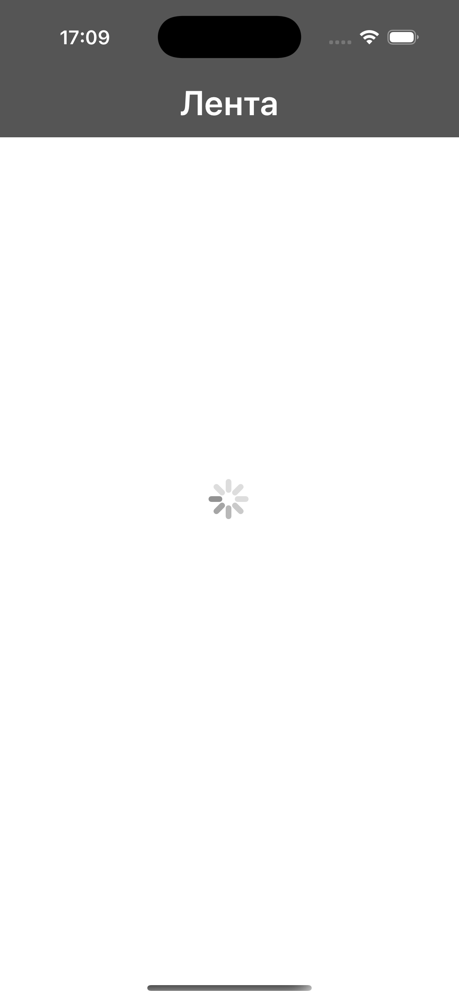
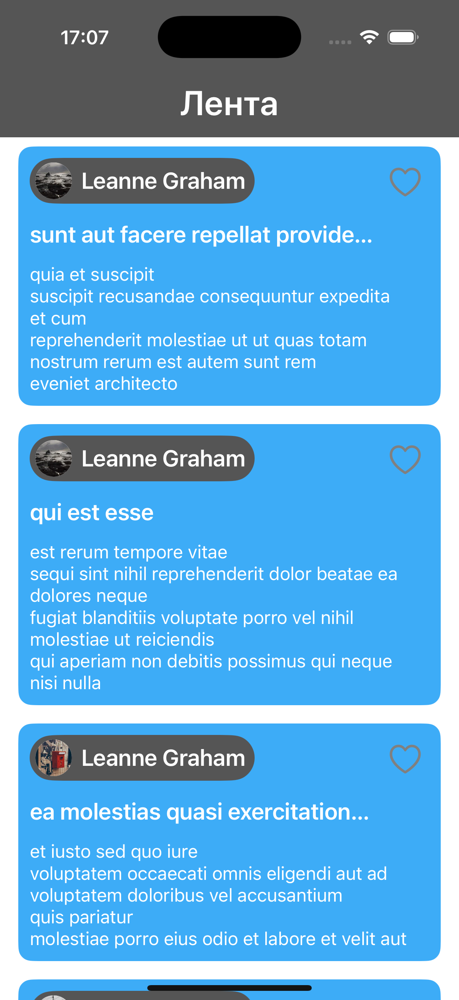
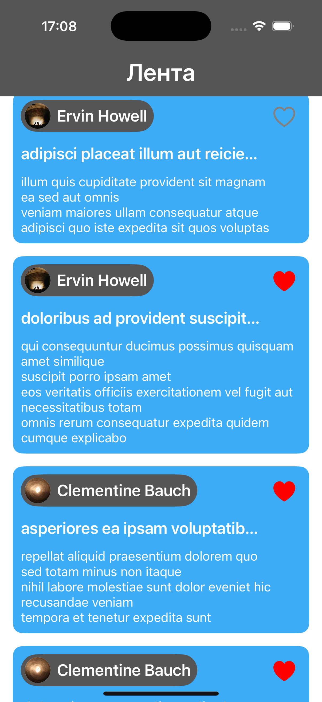
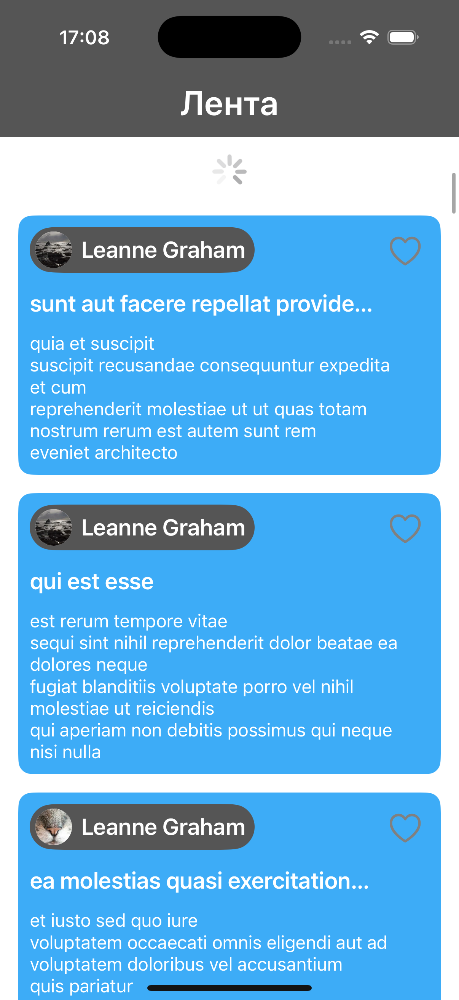

# Social Network Feed

Упрощённая лента социальной сети с загрузкой постов и пользователей, лайками, offline-режимом и поддержкой pull-to-refresh.







---

## Возможности

- Загрузка постов и пользователей с API
- Отображение имени, заголовка, текста и аватарки
- Сохранение постов в CoreData
- Offline-доступ при запуске без интернета
- Поддержка лайков с сохранением состояния
- Pull-to-refresh для обновления ленты
- Индикатор загрузки при старте

---

## Установка и запуск

Чтобы запустить приложение, выполните следующие шаги:

1.  Клонируйте репозиторий:
    ```sh
    git clone https://github.com/ShijaN03/social-network-feed
    ```
2.  Перейдите в директорию проекта и откройте .xcodeproj:
    ```sh
    cd social-network-feed
    open SocialFeed.xcodeproj
    ```
3.  Соберите и запустите приложение на симуляторе или реальном устройстве.

---

## Используемые технологии

* **Swift** 
* **UIKit**
* **VIPER**
* **Auto Layout**
* **Core Data**
* **URLSession**

- **Swift** — язык программирования
- **UIKit** — пользовательский интерфейс
- **VIPER** — архитектура проекта
- **Auto Layout** — адаптивная верстка
- **UITableView** — отображение ленты постов
- **URLSession** — сетевые запросы
- **Core Data** — локальное хранилище и оффлайн-доступ
- **JSONPlaceholder API** — источник моковых данных
- **Picsum.photos** — источник моковых данных

---

## Автор

**Kirill Shiyan** – [GitHub](https://github.com/ShijaN03)

